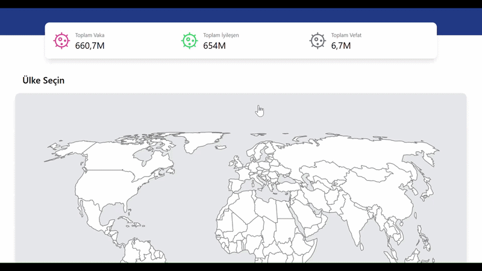

# 🌍 COVID Haritası ve Ülke Detay Uygulaması

Bu proje, **Vite** altyapısı üzerinde geliştirilmiş, **React Redux** ve **React Simple Maps** kütüphanelerini kullanarak ülkelerin temel verilerini listelemeyi ve coğrafi görselleştirmeyi amaçlayan bir web uygulamasıdır. Uygulama, performans ve test süreçlerine önem verilerek tasarlanmıştır.

---

## 🚀 Başlarken

Bu projeyi yerel ortamınızda ayağa kaldırmak ve çalıştırmak için aşağıdaki adımları takip edin.

### Önkoşullar
* **Node.js** (LTS sürümü önerilir)
* **npm** veya **Yarn**

### Kurulum ve Çalıştırma

1.  **Projeyi Klonlayın (Git)**

    Terminal veya komut satırınızda aşağıdaki komutu kullanarak projeyi indirin:
    ```bash
    git clone [https://github.com/HasanEROL1/covid-map-unittest-.git](https://github.com/HasanEROL1/covid-map-unittest-.git)
    ```

2.  **Dizin Değişikliği ve Bağımlılıkları Yükleme**

    Proje klasörüne girin ve gerekli tüm paketleri yükleyin:
    ```bash
    cd covid-map-unittest-
    npm install
    ```

3.  **Projeyi Başlatma**

    Geliştirme sunucusunu başlatın:
    ```bash
    npm run dev
    ```
    Uygulama genellikle `http://localhost:5173` adresinde otomatik olarak açılacaktır.

---

## 🏗️ Proje Yapısı ve Akışı

Uygulama, temel olarak ana sayfa (`Home`) ve detay sayfası (`Detail`) olmak üzere iki ana görünümden oluşur. Ana sayfada ülkelerin istatistiklerini ve harita görselleştirmesini görebilirsiniz.

| Bileşen | Rota | Görev |
| :--- | :--- | :--- |
| **`Home.jsx`** | `/` | Ana sayfa düzenini oluşturur: Toplam verileri, istatistikleri ve haritayı içerir. |
| **`Detail.jsx`** | `/detail/:country` | URL parametresi ile Redux **`getDetails`** aksiyonunu tetikler ve detay verilerini yönetir. |
| **`Header.jsx`** | | Ülke başlığını, bayrağını, yükleme durumunu ve **Geri Git** navigasyon butonunu içerir. |
| **`Content.jsx`** | | Ülkenin detay istatistiklerini listeler ve coğrafi harita görselleştirmesini sunar. |

### Uygulamanın Çalışma Anı (GIF)

**Veri Yükleme ve Detay Görünümü:**
![Uygulamanın yüklenme durumundan veri gösterimine geçtiği GIF] (GIF_URL_YÜKLEME_VE_VERI)

**Geri Navigasyon ve Harita Etkileşimi:**
![Geri butonuna tıklanarak önceki sayfaya başarılı geçişin gösterildiği ve harita ile etkileşimin olduğu GIF] (GIF_URL_GERI_NAVIGASYON_VE_HARITA)

---

## 🧪 Testler

Uygulama, temel işlevselliği ve performans kritik alanları **React Testing Library (RTL)** ve **Jest** kullanılarak test edilmiştir. Testler, doğru ve verimli bir kod tabanı sağlamayı amaçlar.

### Testleri Çalıştırma

Tüm testleri çalıştırmak için terminalde aşağıdaki komutu kullanın:

```bash

🌍 COVID Haritası ve Ülke Detay Uygulaması
Bu proje, Vite altyapısı üzerinde geliştirilmiş, React Redux ve React Simple Maps kütüphanelerini kullanarak ülkelerin temel verilerini listelemeyi ve coğrafi görselleştirmeyi amaçlayan bir web uygulamasıdır. Uygulama, performans ve test süreçlerine önem verilerek tasarlanmıştır.

🚀 Başlarken
Bu projeyi yerel ortamınızda ayağa kaldırmak ve çalıştırmak için aşağıdaki adımları takip edin.

Önkoşullar
Node.js (LTS sürümü önerilir)

npm veya Yarn

Kurulum ve Çalıştırma
Projeyi Klonlayın (Git)

Terminal veya komut satırınızda aşağıdaki komutu kullanarak projeyi indirin:
git clone https://github.com/HasanEROL1/covid-map-unittest-.git

cd covid-map-unittest-
npm install


🏗️ Proje Yapısı ve Akışı
Uygulama, temel olarak ana sayfa (Home) ve detay sayfası (Detail) olmak üzere iki ana görünümden oluşur.
Anasayfada total veriler ve harita ile  ülkelerin
istatistiklerini görebilirsiniz


Harika! İşte tüm içeriğinizi Git/Markdown diline (yani .md dosyasına) uygun, profesyonel bir formatta düzenlenmiş hali:

Markdown

# 🌍 COVID Haritası ve Ülke Detay Uygulaması

Bu proje, **Vite** altyapısı üzerinde geliştirilmiş, **React Redux** ve **React Simple Maps** kütüphanelerini kullanarak ülkelerin temel verilerini listelemeyi ve coğrafi görselleştirmeyi amaçlayan bir web uygulamasıdır. Uygulama, performans ve test süreçlerine önem verilerek tasarlanmıştır.

---

## 🚀 Başlarken

Bu projeyi yerel ortamınızda ayağa kaldırmak ve çalıştırmak için aşağıdaki adımları takip edin.

### Önkoşullar
* **Node.js** (LTS sürümü önerilir)
* **npm** veya **Yarn**

### Kurulum ve Çalıştırma

1.  **Projeyi Klonlayın (Git)**

    Terminal veya komut satırınızda aşağıdaki komutu kullanarak projeyi indirin:
    ```bash
    git clone [https://github.com/HasanEROL1/covid-map-unittest-.git](https://github.com/HasanEROL1/covid-map-unittest-.git)
    ```

2.  **Dizin Değişikliği ve Bağımlılıkları Yükleme**

    Proje klasörüne girin ve gerekli tüm paketleri yükleyin:
    ```bash
    cd covid-map-unittest-
    npm install
    ```

3.  **Projeyi Başlatma**

    Geliştirme sunucusunu başlatın:
    ```bash
    npm run dev
    ```
    Uygulama genellikle `http://localhost:5173` adresinde otomatik olarak açılacaktır.

---

## 🏗️ Proje Yapısı ve Akışı

Uygulama, temel olarak ana sayfa (`Home`) ve detay sayfası (`Detail`) olmak üzere iki ana görünümden oluşur. Ana sayfada ülkelerin istatistiklerini ve harita görselleştirmesini görebilirsiniz.

| Bileşen | Rota | Görev |
| :--- | :--- | :--- |
| **`Home.jsx`** | `/` | Ana sayfa düzenini oluşturur: Toplam verileri, istatistikleri ve haritayı içerir. |
| **`Detail.jsx`** | `/detail/:country` | URL parametresi ile Redux **`getDetails`** aksiyonunu tetikler ve detay verilerini yönetir. |
| **`Header.jsx`** | | Ülke başlığını, bayrağını, yükleme durumunu ve **Geri Git** navigasyon butonunu içerir. |
| **`Content.jsx`** | | Ülkenin detay istatistiklerini listeler ve coğrafi harita görselleştirmesini sunar. |

### Uygulamanın Çalışma Anı (GIF)

**Veri Yükleme ve Detay Görünümü:**


**Geri Navigasyon ve Harita Etkileşimi:**
![Geri butonuna tıklanarak önceki sayfaya başarılı geçişin gösterildiği ve harita ile etkileşimin olduğu GIF] (GIF_URL_GERI_NAVIGASYON_VE_HARITA)

---

## 🧪 Testler

Uygulama, temel işlevselliği ve performans kritik alanları **React Testing Library (RTL)** ve **Jest** kullanılarak test edilmiştir. Testler, doğru ve verimli bir kod tabanı sağlamayı amaçlar.

### Testleri Çalıştırma

Tüm testleri çalıştırmak için terminalde aşağıdaki komutu kullanın:

```bash


## 🛠 Kütüphaneler ve Teknolojiler

- Bu proje, modern web standartları ve Test-Driven Development (TDD) prensipleri dikkate alınarak geliştirilmiştir.-- Kullanılan başlıca araçlar ve versiyonları şunlardır:🚀 Ana Teknolojiler (Dependencies)KütüphaneVersiyonGörevReact18.2.0Kullanıcı arayüzü ve bileşen tabanlı mimari.Redux Toolkit2.10.1Merkezi durum yönetimi ve veri akışı.React Router Dom7.9.5Sayfalar arası dinamik yönlendirme ve URL yönetimi.Axios1.13.2Veri çekme ve HTTP istek yönetimi.React Simple Maps3.0.0Ülkelerin coğrafi verilerini harita üzerinde görselleştirme.Tailwind CSS3.4.18Modern, responsive ve hızlı arayüz tasarımı.Millify6.1.0Büyük sayısal verilerin kullanıcı dostu formatlanması.